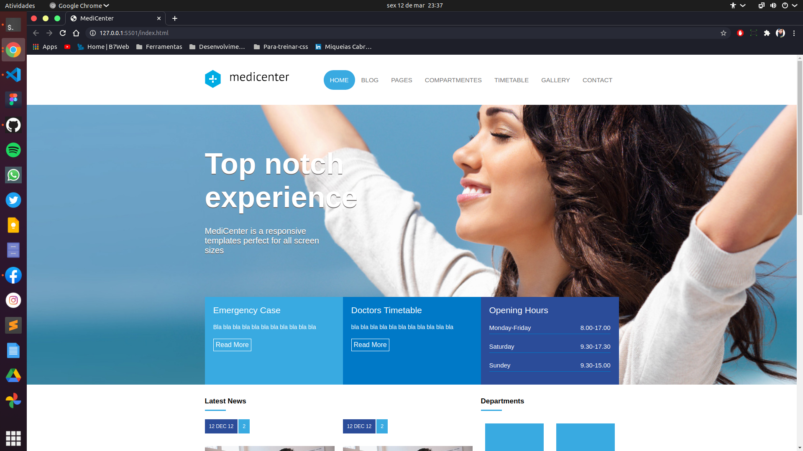
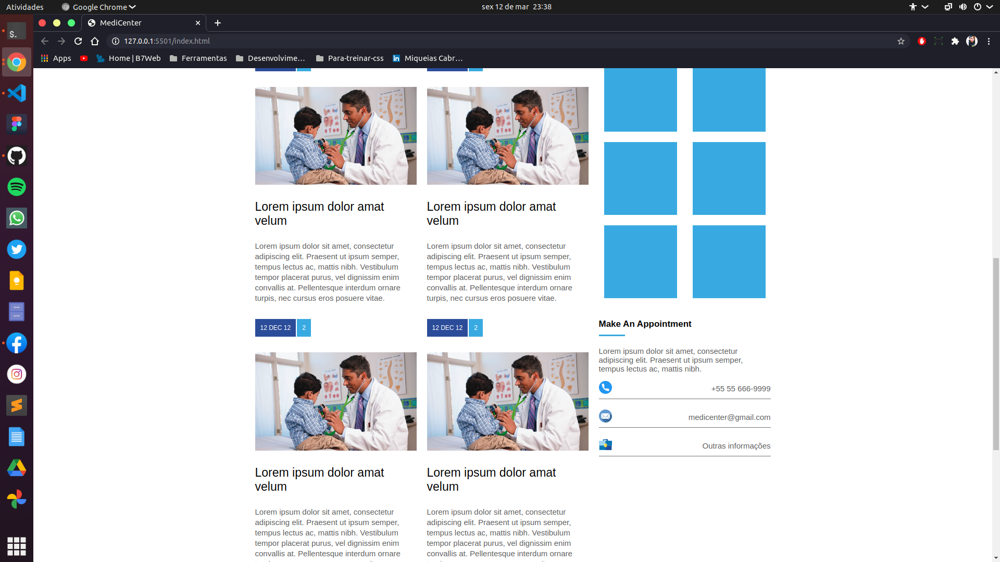
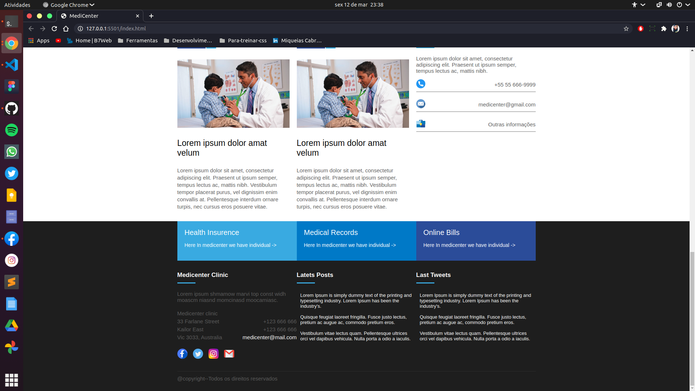

 
  

  &#xa0;

  <!-- <a href="https://projetopraticoflexbox.netlify.app">Demo</a> -->

<h1 align="center">Projeto Pratico Flexbox</h1>

 

Projeto pratico para fins didaticos 🧐, e para praticar as tecnologias estudadas durante o curso que estou realizando. Projeto com uso do Flex Box 🟦 e HTML5 semantico 🥰, 80% responsivo. 🤯🚀 

  
  
  

Desenvolvido de ❤️ por <a href="https://github.com/miqueiascabral" target="_blank">Miqueias Cabral</a>
🧑‍💻

&#xa0;

<a href="#top">Voltar ao Topo </a>
